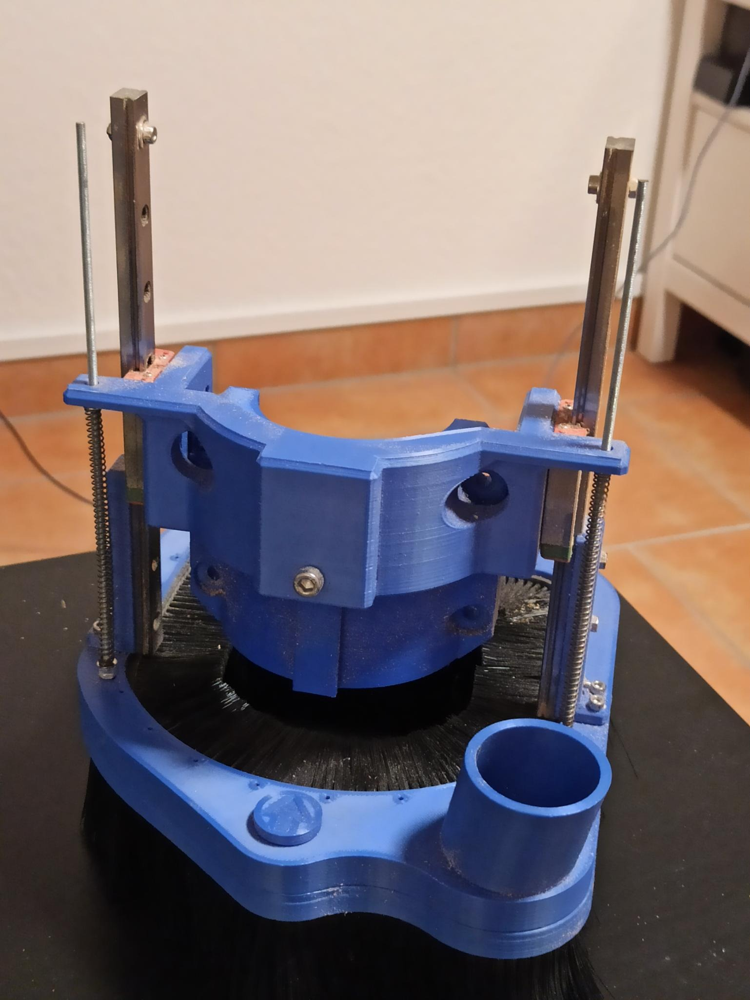

# Moving brush attachment for the vacuum funnel

*Creator: @4cello#7203*

## Part descriptions

This is a pretty poor attempt to create a dust shoe that moves up and down independently from the router
(or at least: more independent). It attaches to the vertical slider using the 200mm rails I had left over after
upgrading my Z travel with 250mm rails. To push the dust shoe against the wasteboard/workpiece, springs are installed between
router clamp and dust shoe. However, it is very hard to get the length and stiffness of the springs tuned just right so the
bristles of the brush don't get squished.

The dust shoe itself is designed to use "Mink Flex FBL3002" brush strips, I used a bristle length of 50mm. The slot for the brush strip
is 6mm wide and 7mm deep. The same brush strip is also used to provide a seal against the router (+clamp) even when it moves up or down.

The brush part itself is magnetically attached to the rest of the mechanism so it can be removed for tool changes
(although it can be annoying to get it past the endmill...).

The dust shoe has 2 holes: 1 for the vacuum hose and 1 for pressurized air. I don't actually know how practical this is going to be, but I thought it could be helpful to blow onto the cutting bit to send heavier particles airborne for the shop vac to suck up.

## Future work
While this version improves on the shortcomings of the fixed brush attachment, it is fundamentally flawed: Since the height of the
workpiece is usually constant during a job, the dustshoe doesn't actually need to apply varying pressure depending on the cutting
depth. Instead, it would be much more reasonable if the rails were attached to the carriage, so the height could be adjusted once
for each job.

Alexandre Chappel made a dust shoe based on this principle in this YouTube video: https://www.youtube.com/watch?v=qFIYdQG0TTE